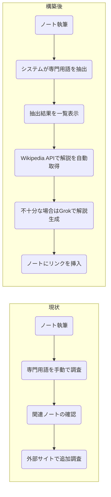
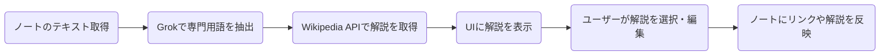
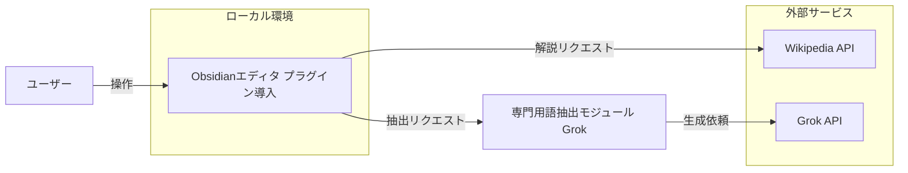
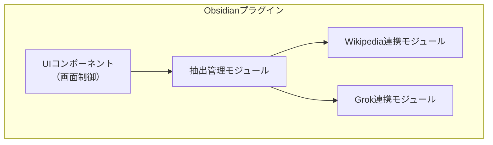
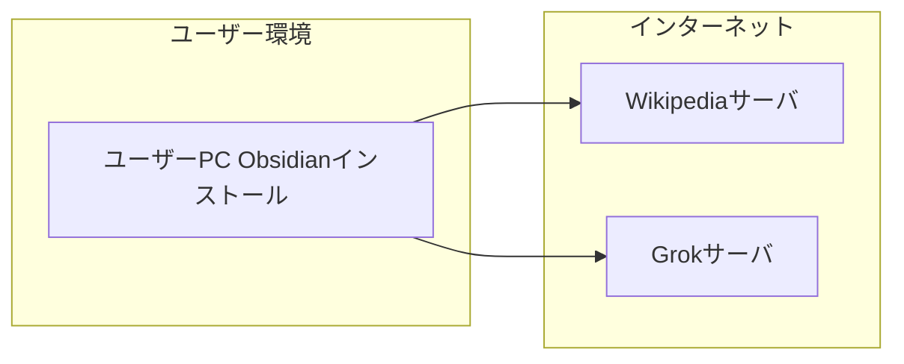
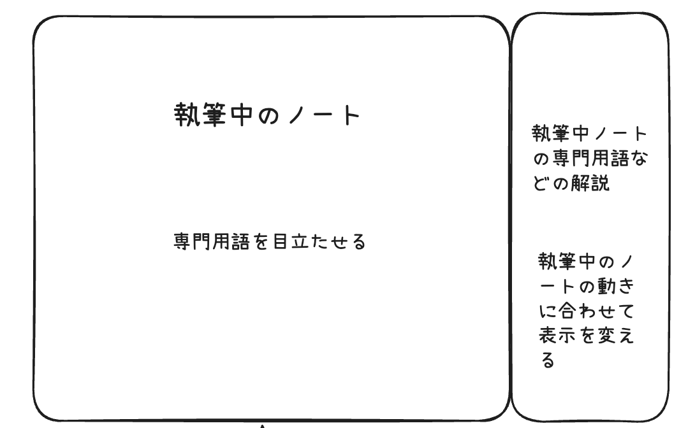
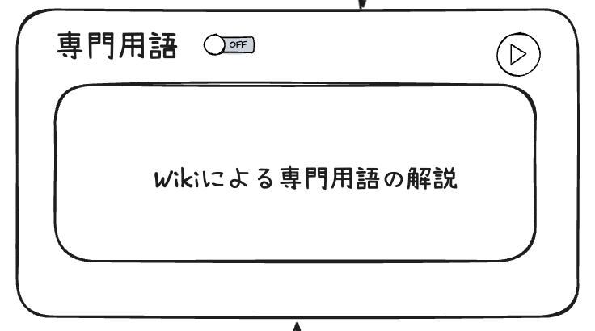
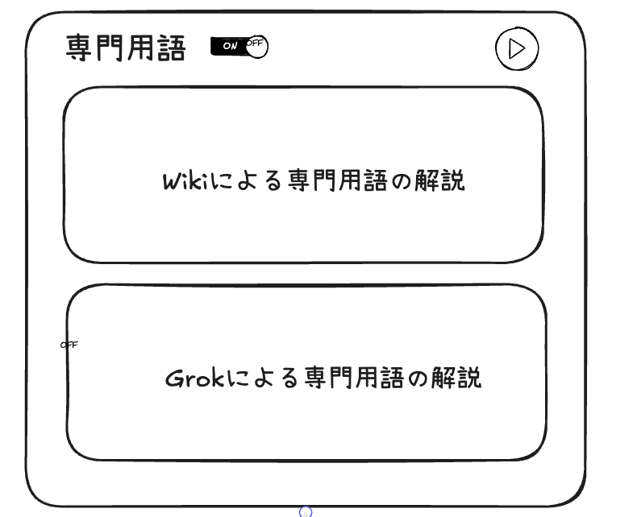
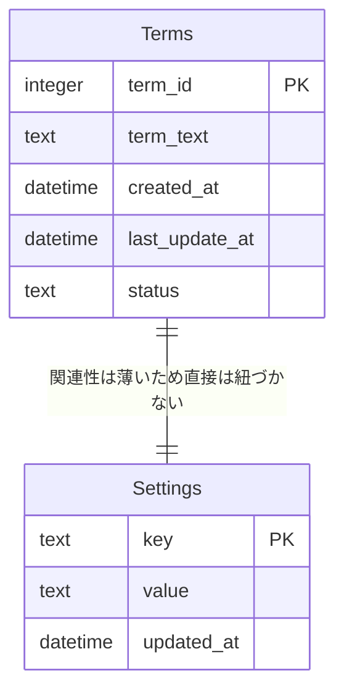
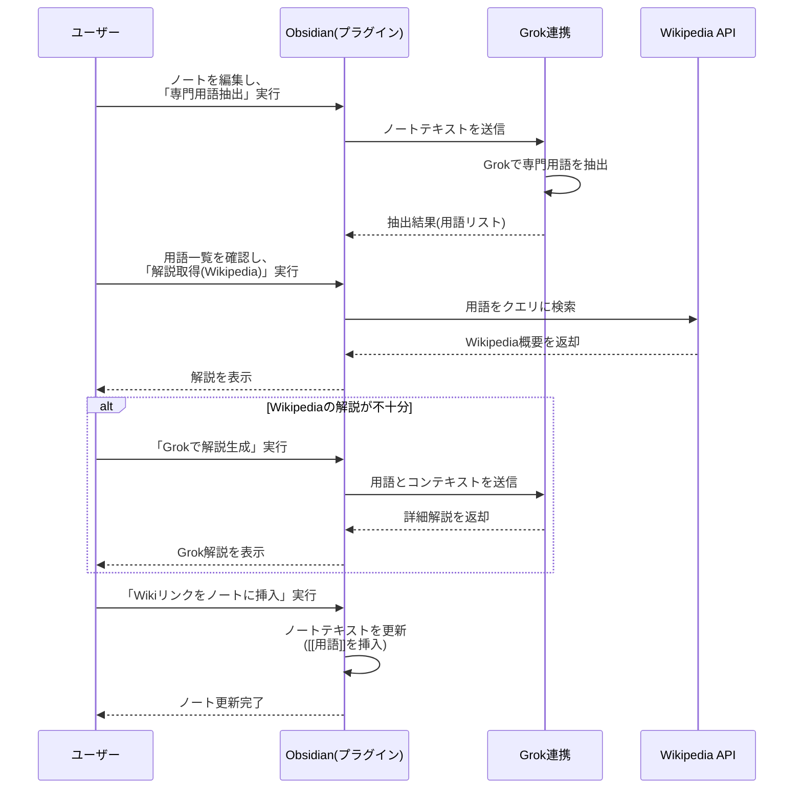

# obsidian-omniwiki-plugin
# 要件定義書

## 1. 目的

本システムは、**Obsidianノート**上での執筆作業を支援するために、以下の機能を提供することを目的とします。

1. ノートのテキストから専門用語を自動抽出する。
2. 抽出した専門用語の解説を、Wikipedia APIまたはGrokによって取得・生成する。
3. 必要に応じてノート内にWikiリンクを作成し、参照しやすくする。

これにより、ユーザーは執筆中に専門用語の定義や背景知識を素早く把握でき、情報収集の時間を大幅に短縮できます。

## 2. システム概要

### 2.1 システム構成

本システムは、以下の4つのコンポーネントで構成されます。

1. **専門用語抽出モジュール**
    
    - Grokなどの自然言語処理技術を用いて、ノートの文章から専門用語を自動抽出する。
    - 利用者の分野に応じて精度向上が可能な仕組み（カスタム辞書や学習モデルの差し替えなど）を検討。
2. **Wikipedia API連携モジュール**
    
    - 抽出した専門用語に対してWikipedia APIを呼び出し、概要や関連情報を取得する。
    - 取得するデータは主に「タイトル」「概要」「URLリンク」「画像」など。
3. **Grok解説生成モジュール**
    
    - Wikipediaの説明が不十分・不適切と感じた場合、ユーザーがGrokに専門用語の解説生成を依頼できる。
    - Grokの出力結果をユーザーが確認し、必要に応じて編集可能。
4. **UIコンポーネント**
    
    - 抽出された専門用語の一覧を表示する画面。
    - Wikipedia APIやGrokから取得・生成した解説を表示するパネル。
    - ノート内にWikiリンクを挿入するためのボタンや設定画面。

### 2.2 用語定義

- **専門用語抽出**: Grokなどを活用し、文章中に含まれる固有名詞や専門用語を特定し、リスト形式で取得する機能。
- **Wikipedia API**: Wikipediaの情報を取得するためのREST API。エンドポイント例: `https://ja.wikipedia.org/w/api.php` など。
- **Grok**: AIを用いた自然言語処理システム。与えられたテキストや専門用語に対して、要約・解説を生成可能。
- **Wikiリンク**: Obsidianノート内で `[[専門用語]]` という形式を用いて相互リンクを作成する機能。

## 3. 業務要件

### 3.1 現状のフロー

1. ユーザーがObsidianでノートを執筆する。
2. 専門用語を見つけるたびに手動で調査し、既存ノートや外部サイトを参照する。
3. 関連情報が見つからない場合は、新規にノートを作成したり、ブラウザで追加調査を行う。

### 3.2 構築後のフロー

1. ユーザーがObsidianでノートを執筆する。
2. 本システムが自動的に専門用語を抽出し、候補をリスト化する。
3. Wikipedia APIから解説を自動取得し、ユーザーに表示する。
4. ユーザーがより詳細な説明を希望する場合はGrokで解説を生成する。
5. 必要に応じて、ノート内にWikiリンク（`[[専門用語]]`）を挿入する。

## 4. 利用者と規模

### 4.1 利用者

- **Obsidianユーザー**:
    - 個人レベル: 研究者、学生、技術者、ライターなど。
    - チームレベル: プロジェクト内で知識共有を行うチーム。

### 4.2 規模

- 当初は個人利用を想定。
- 将来的にはチームや組織内での利用拡大を想定。
- ノートの数や文字量が増加した際のパフォーマンスや拡張性も考慮する。

## 5. 機能要件

### 5.1 画面要件

1. **専門用語一覧画面**
    
    - 抽出された専門用語がリスト形式で表示される。
    - 各専門用語に対して「Wikipedia解説表示ボタン」「Grok解説生成ボタン」「リンク挿入ボタン」などの操作を用意。
2. **解説表示パネル**
    
    - 専門用語の概要や定義を表示。
    - Wikipediaから取得した情報と、Grokが生成した情報の両方を比較・選択可能。
    - 追加で解説を編集できるテキストエリアを用意する場合も検討。
3. **設定画面**
    
    - Wikipediaの利用可否や言語設定（日本語・英語など）
    - GrokのAPIキー入力や自動利用可否
    - 抽出の精度設定（「学術論文向け」「一般記事向け」などのプリセット）

### 5.2 権限要件

- **一般ユーザー**:
    - 専門用語抽出結果の閲覧
    - Wikipedia / Grok 解説の選択・反映
    - システム設定の変更（APIキーや利用可否など）

> 特別な管理者権限は想定しないが、チーム利用時はメンバーごとに設定変更の可否を制限することも検討。

### 5.3 データ要件

- **入力データ**:
    - ノートのテキストデータ（Markdown形式が中心）
- **出力データ**:
    - 抽出された専門用語リスト（内部管理用のデータ構造）
    - Wikipedia APIから取得した解説データ（タイトル、要約、URLなど）
    - Grokが生成した解説データ（ユーザーがカスタマイズ可能）
    - ノートに挿入されるWikiリンク（`[[専門用語]]` 形式）

### 5.4 外部インタフェース要件

1. **Wikipedia API**
    
    - REST形式のAPIを使用し、検索クエリやタイトルから記事情報を取得。
    - 日本語版Wikipediaを標準とし、ユーザーの言語設定によって切り替え可能。
2. **Grok API**
    
    - REST形式または専用のAPIエンドポイントを使用。
    - テキスト入力（専門用語や背景情報）に対して要約・解説を生成。
    - 一度の呼び出しで取得できる文字数・回数制限などを考慮（APIの利用料金や制限がある場合）。

### 5.5 データフロー

1. **ノートのテキストを取得**
    - Obsidianの内部APIまたはプラグイン機能を介してテキストを読み込む。
2. **Grokで専門用語を抽出**
    - 自然言語処理を用い、固有名詞や技術用語を特定。
    - 抽出した専門用語をシステム内部で一時管理。
3. **Wikipedia APIで解説を取得**
    - 専門用語をクエリに、Wikipediaの概要・URLなどを取得。
4. **UIに解説を表示**
    - 取得結果やGrokの解説生成機能を画面上に表示。
5. **ユーザーが解説を選択・編集**
    - WikipediaかGrokか、またはユーザー自身の追記を含め、最終的な解説を決定。
6. **ノートにリンクや解説を反映**
    - 必要に応じて、Wikiリンク（`[[用語]]`）をノートに挿入。
    - ユーザーの選択内容をノート本文に反映し、関連ノートを自動生成する機能も検討。

## 6. 非機能要件

### 6.1 パフォーマンス・応答時間

- 一般的な個人利用（数千〜数万文字のノート）において、専門用語抽出や解説取得が数秒〜十数秒以内に完了すること。
- 同時に複数のノートを開いていても、最低限の応答性能を維持できる設計。

### 6.2 互換性

- **Obsidianの最新安定版**と互換性を保つ。
- **Wikipedia API**や**Grok**のバージョンアップ・仕様変更に追随可能な拡張性を確保。

### 6.3 信頼性・可用性

- Wikipedia APIやGrok APIが利用不可（ネットワーク障害やAPI障害）になった場合でも、ノート執筆や既存のリンク参照が阻害されないようにする。
- 連携エラー時のメッセージをユーザーにわかりやすく表示し、手動リトライや代替手段（別の検索エンジン利用など）を促す。

### 6.4 セキュリティ

- APIキーやユーザー認証情報は安全に保管し、第三者に漏洩しない設計。
- 可能であれば、Obsidianのプラグイン機能が提供するセキュアなストレージを活用する。
- 通信はHTTPSを用いて行い、平文でのAPIキー送信を防ぐ。

## 7. 運用・保守要件

1. **設定変更の容易性**
    
    - UI上でWikipedia APIの言語設定やGrokのAPIキーを変更できる。
    - APIが有料の場合、月間利用回数の確認など、課金状況がわかる仕組みを検討。
2. **バージョン管理**
    
    - Obsidianのプラグインとして提供する場合、リリース時のバージョン管理（GitHub等）を行う。
    - GrokやWikipedia APIの変更点を随時追跡し、対応版をリリース。
3. **ログ管理**
    
    - 専門用語抽出や解説取得のリクエスト履歴を保持し、トラブルシュートに活用。
    - 個人利用の場合は簡易的で十分だが、チーム利用を想定する場合はアクセスログの管理も検討。

## 8. 導入効果

1. **作業効率の向上**
    
    - 従来、手動で専門用語を検索していた時間を大幅に削減。
    - ノート執筆の流れを中断することなく、解説を参照できる。
2. **ノート品質の向上**
    
    - 専門用語の解説をノート内に容易に挿入できるため、文書のわかりやすさが向上。
    - リンクの作成によって関連ノートとの相互参照性が高まり、知識が体系化される。
3. **学習コスト削減**
    
    - 分野外の専門用語にもすぐアクセスでき、学習がスムーズに進む。
    - ユーザー自身が追記した解説を資産として蓄積できる。

# 基本設計書

## 1. はじめに

### 1.1 目的

- Obsidianノートでの執筆作業を効率化するため、以下の機能を提供するプラグインを開発する。
    1. ノートのテキストから専門用語を自動抽出
    2. 抽出した専門用語に対する解説をWikipedia APIまたはGrokで取得・生成
    3. ノート内にWikiリンク（`[[専門用語]]`）を挿入し、関連情報へアクセスしやすくする

### 1.2 前提

- Obsidianのプラグインとして開発し、ユーザーがインストール・有効化して利用する。
- Wikipedia APIやGrok APIを呼び出すためのネットワークアクセスが必要。
- 将来的にチーム利用も考慮し、拡張性を持った設計を行う。

---

## 2. システム構成図

下図は、本システムがどのような要素で構成され、どのように連携しているかを示したものです。

- **ユーザー**: Obsidian上でノートを執筆し、本プラグインを操作する。
- **Obsidian（プラグイン）**:
    - ノートテキストを取得し、専門用語抽出モジュールやWikipedia APIにリクエストを送信。
    - UI画面で抽出結果や解説を表示し、Wikiリンクを挿入する。
- **Grok API**:
    - 専門用語や文章を入力とし、より詳細な解説や文章生成を行う。
- **Wikipedia API**:
    - 抽出した専門用語をクエリに、記事の概要やURLを取得。

---

## 3. ソフトウェア構成図

ソフトウェアの内部モジュール構成を示します。プラグイン内部で役割分担し、外部APIとの連携を行います。

1. **UIコンポーネント（画面制御）**
    
    - 専門用語一覧画面、解説表示画面、設定画面などのUIを管理。
    - ユーザー操作（ボタン押下など）を受け取り、他モジュールへ指示を送る。
2. **抽出管理モジュール**
    
    - ノートテキストを取得し、Grokを用いて専門用語を抽出するための処理を統括。
    - 抽出結果のフィルタリングや重複排除などのロジックを実装。
3. **Wikipedia連携モジュール**
    
    - 抽出した専門用語をWikipedia APIに問い合わせ、概要やURL等の情報を取得。
    - APIレスポンスの解析・整形を行い、UIコンポーネントに渡す。
4. **Grok連携モジュール**
    
    - 専門用語のより詳細な解説が必要な場合に、Grok APIを呼び出す。
    - APIレスポンスの解析やエラー処理を行う。

---

## 4. ネットワーク構成図

ユーザー端末（ローカルPC）上で動作するObsidianと、外部APIを利用する際のネットワーク構成を示します。

- **ユーザーPC**: Obsidianプラグインが動作するローカル環境。
- **Wikipediaサーバ**: Wikipedia APIを提供するサーバ。
- **Grokサーバ**: Grok APIを提供するサーバ。
- 通信はHTTPSを利用し、APIキー等は安全に送受信する。

---

## 5. 機能設計

### 5.1 機能一覧

|機能名|概要|使用モジュール|
|---|---|---|
|専門用語抽出|ノートテキストから専門用語を自動検出し、リスト化する|抽出管理モジュール (Grok連携)|
|Wikipedia解説取得|抽出した専門用語をWikipedia APIに問い合わせ、概要を取得して表示|Wikipedia連携モジュール|
|Grok解説生成|Wikipediaの説明が不十分な場合、Grok APIを利用して詳細な解説を生成する|Grok連携モジュール|
|Wikiリンク挿入|選択した専門用語を`[[専門用語]]`形式でノートにリンク挿入する|UIコンポーネント、抽出管理モジュール|
|設定管理|Wikipedia APIやGrok APIの利用可否、APIキーの登録、抽出精度設定などを行う|UIコンポーネント|

### 5.2 機能詳細

- **専門用語抽出**
    
    - Grok APIにノート全文を送信し、抽出結果を受け取る。
    - 短いフレーズや固有名詞などを判別し、重複・誤抽出を除去。
- **Wikipedia解説取得**
    
    - 専門用語をクエリとしてWikipedia APIを呼び出す。
    - ページが見つからない場合や曖昧な場合はUIに通知し、ユーザーに再検索やGrok解説生成を促す。
- **Grok解説生成**
    
    - ユーザーが「詳細解説生成」ボタンを押下するとGrok連携モジュールが呼ばれる。
    - Grok APIへの入力として、専門用語と任意の追加文脈を送信。
    - 返却されたテキストをUIで確認・編集可能。
- **Wikiリンク挿入**
    
    - 抽出管理モジュールが把握している専門用語をMarkdownテキストに`[[用語]]`形式で挿入する。
    - 既にリンクが存在する場合は重複挿入を避ける。

---

## 6. 画面設計

### 6.1 画面一覧

1. **専門用語一覧画面**
    
    - 抽出された用語をリスト表示
    - Wikipedia解説やGrok解説の呼び出しボタンを配置
    - リンク挿入ボタン
2. **解説表示パネル**
    
    - Wikipediaから取得した概要とリンク先URL
    - Grokが生成した解説（任意で編集可能）
    - 決定ボタンでノートへ反映
3. **設定画面**
    
    - Wikipedia APIの利用可否（言語選択など）
    - Grok APIキーの入力欄
    - 抽出精度・除外ワード設定など

### 6.2 画面レイアウト（例）

---

## 7. データベース設計

### 7.1 テーブル構成

個人利用が中心の場合、必ずしもローカルDBを持たずに、Obsidianのファイルベースで完結する可能性もあります。ただし、抽出結果の履歴やユーザー設定を保存するため、簡易的なDB（ローカルDBやJSONファイル）を用いることを想定します。

例として、下記2テーブルを想定します。

1. **Terms**
    
    - 抽出した専門用語やステータスを保持
    
    |カラム名|型|説明|
    |---|---|---|
    |term_id|INTEGER|主キー|
    |term_text|TEXT|専門用語の文字列|
    |created_at|DATETIME|抽出日時|
    |last_update_at|DATETIME|最終更新日時|
    |status|TEXT|状態（例: `pending`, `linked`）|
    
2. **Settings**
    
    - APIキーやユーザー設定を保持
    
    |カラム名|型|説明|
    |---|---|---|
    |key|TEXT|設定項目名 (例: `grok_api_key`)|
    |value|TEXT|設定値 (例: 実際のキー文字列)|
    |updated_at|DATETIME|最終更新日時|
    

### 7.2 ER図

- `Terms` と `Settings` は独立したテーブルであり、明示的なリレーションはありません。
- 必要に応じて、ユーザーがカスタム辞書や抽出ルールを保存するテーブルを追加してもよいでしょう。

---

## 8. 処理フロー（シーケンス図）

以下に、専門用語抽出からノートへのリンク挿入までの大まかな流れをシーケンス図で示します。

1. **専門用語抽出**
    
    - ユーザーが「専門用語抽出」を指示すると、プラグインはGrok連携モジュールを通じてGrok APIへノートテキストを送信。
    - Grokが用語を抽出し、結果をプラグインに返す。
2. **Wikipedia解説取得**
    
    - ユーザーが任意の用語に対し「解説取得」を行うと、Wikipedia APIにクエリを送信。
    - 概要やURLを受け取り、UIに表示。
3. **Grok解説生成**（必要に応じて）
    
    - Wikipediaの情報が不十分な場合、Grokに追加で解説生成を依頼。
    - 返却された文章をユーザーが確認・編集できる。
4. **Wikiリンク挿入**
    
    - ユーザーがリンク挿入を実行すると、プラグインがノートテキストに `[[用語]]` を挿入。
    - 更新結果をノートに反映。

---

# 以上

上記の基本設計書では、システムの構成からソフトウェアモジュール、ネットワーク構成、機能・画面・データベース設計、そして処理フローまでを一通り網羅しています。  
今後、詳細設計や実装段階においては、以下の点を追加検討・補足すると良いでしょう。

- **エラー処理の詳細**: API障害やネットワーク切断時のリトライやメッセージ表示
- **セキュリティ**: APIキーの安全管理やHTTPS通信の取り扱い
- **パフォーマンス**: 大規模ノートを扱う際の処理時間、キャッシュの活用方法
- **拡張性**: チーム利用時の同期機能、カスタム辞書テーブルの追加設計

これらを踏まえて実装を進めることで、ユーザーにとって使いやすい専門用語抽出・解説支援システムを構築できます。
