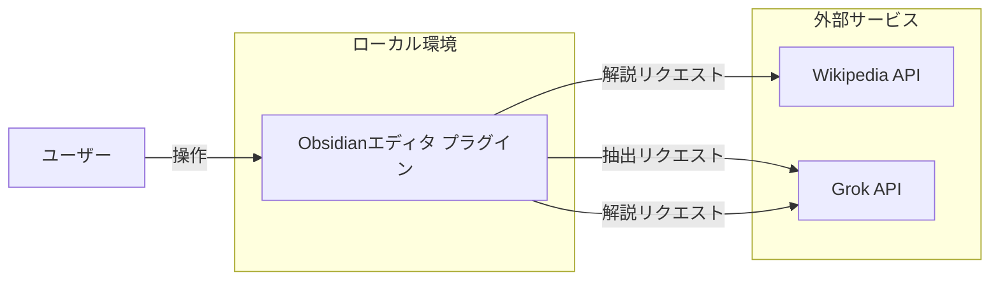
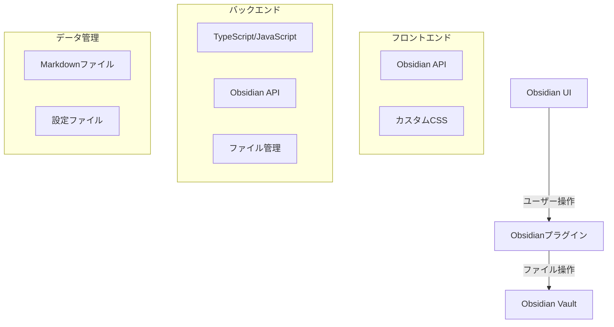
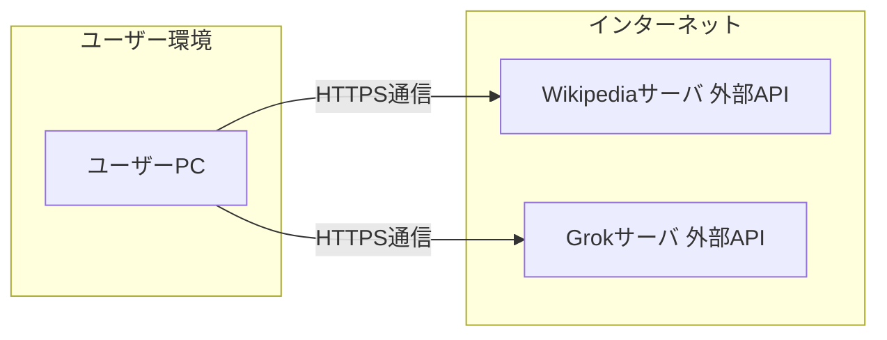
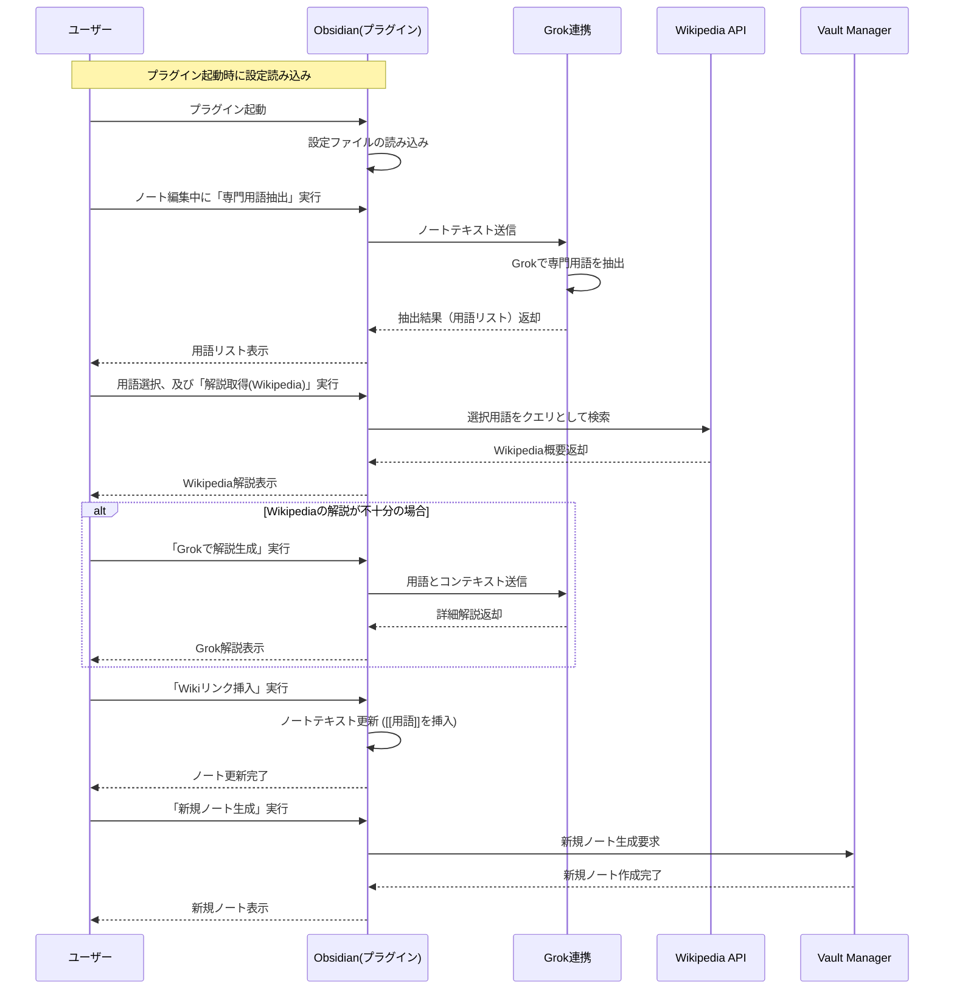
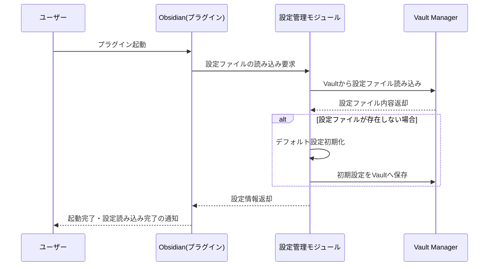
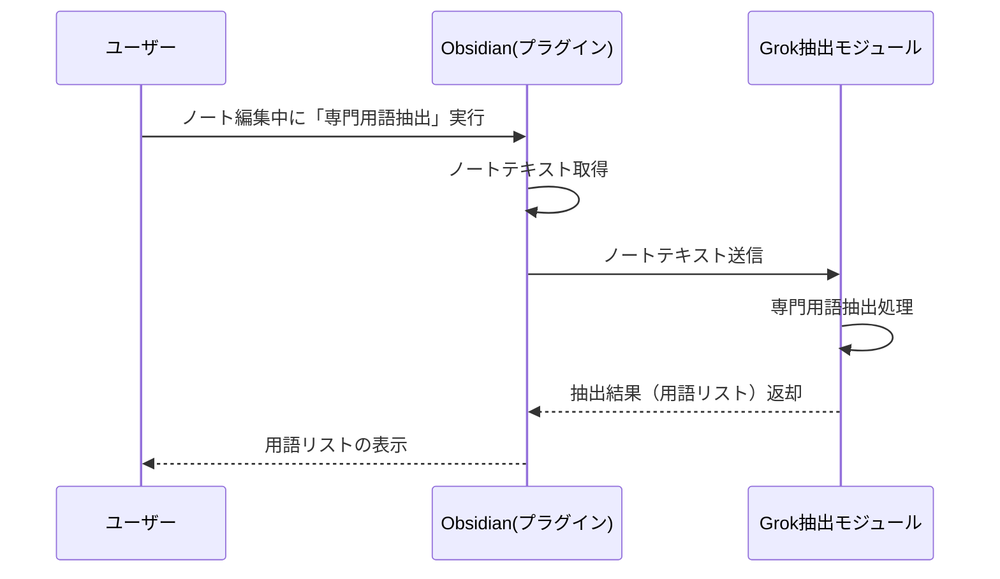
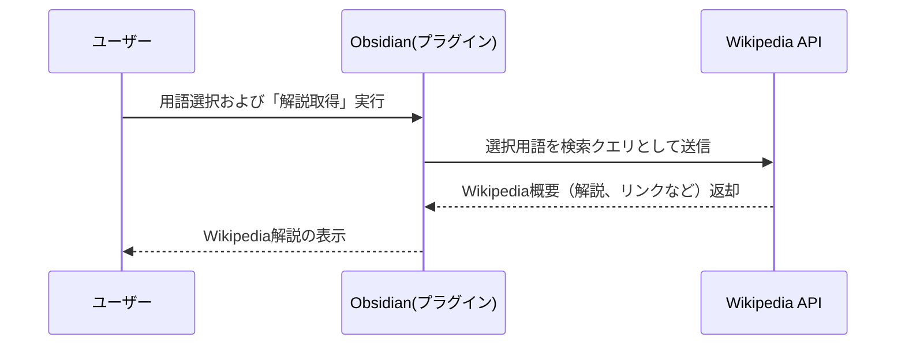
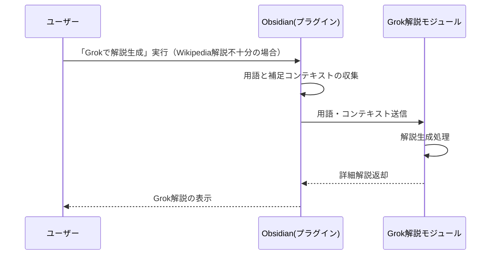
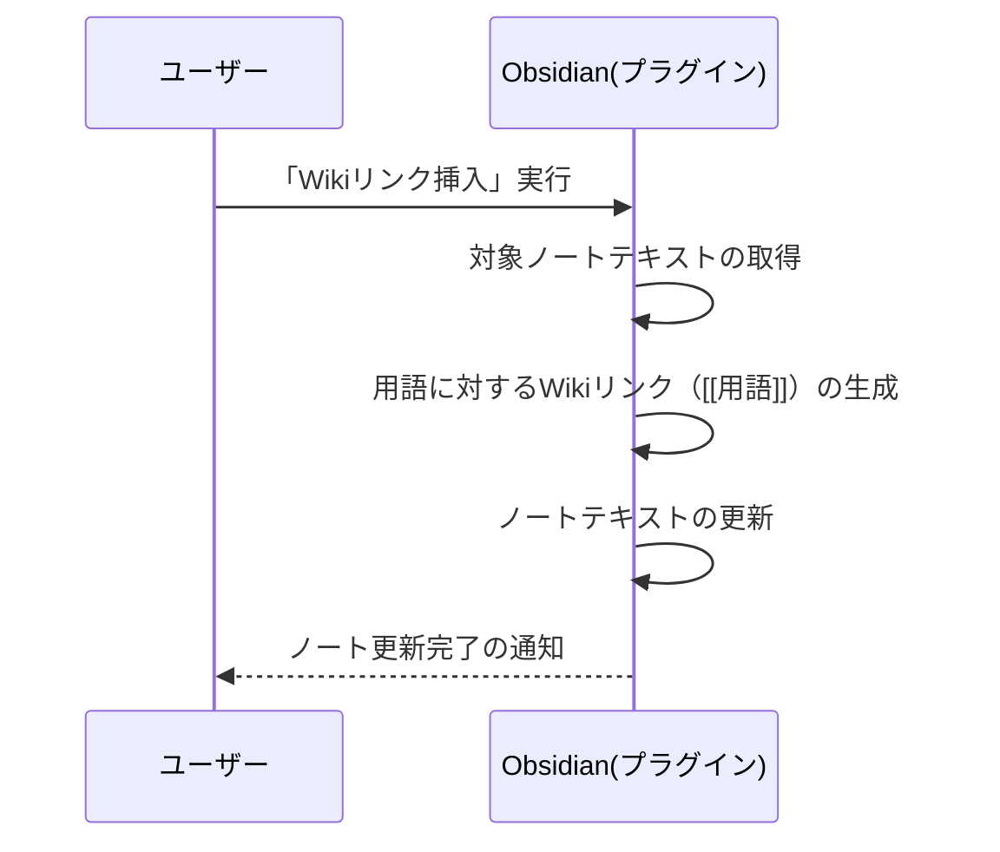
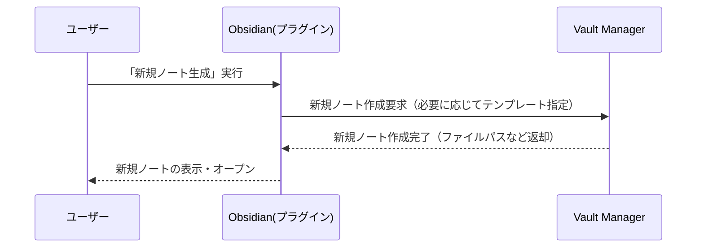

# 基本設計書

## 1. はじめに

### 1.1 目的

- Obsidianノートでの執筆作業を効率化するため、以下の機能を提供するプラグインを開発する。
    1. ノートのテキストから専門用語を自動抽出
    2. 抽出した専門用語に対する解説をWikipedia APIまたはGrokで取得・生成
    3. ノート内にWikiリンク（`[[専門用語]]`）を挿入し、関連情報へアクセスしやすくする

### 1.2 前提

- Obsidianのプラグインとして開発し、ユーザーがインストール・有効化して利用する。
- Wikipedia APIやGrok APIを呼び出すためのネットワークアクセスが必要。
- 将来的にチーム利用も考慮し、拡張性を持った設計を行う。

---

## 2. システム構成図

下図は、本システムがどのような要素で構成され、どのように連携しているかを示したものです。

---

## 3. ソフトウェア構成図

---

## 4. ネットワーク構成図

ユーザー端末（ローカルPC）上で動作するObsidianと、外部APIを利用する際のネットワーク構成を示します。

- **ユーザーPC**: Obsidianプラグインが動作するローカル環境。
- **Wikipediaサーバ**: Wikipedia APIを提供するサーバ。
- **Grokサーバ**: Grok APIを提供するサーバ。
- 通信はHTTPSを利用し、APIキー等は安全に送受信する。

---

## 5. 機能設計

### 5.1 機能一覧

| 機能名           | 概要                                               | 関連    |
| ------------- | ------------------------------------------------ | ----- |
| 設定管理          | Wikipedia APIやGrok APIの利用可否、APIキーの登録、抽出精度設定などを行う | 機能要件1 |
| 専門用語抽出        | ノートテキストから専門用語を自動検出し、リスト化する                       | 機能要件2 |
| Wikipedia解説取得 | 抽出した専門用語をWikipedia APIに問い合わせ、概要を取得して表示           | 機能要件3 |
| Grok解説生成      | Wikipediaの説明が不十分な場合、Grok APIを利用して詳細な解説を生成する      | 機能要件4 |
| Wikiリンク挿入     | 選択した専門用語を`[[専門用語]]`形式でノートにリンク挿入する                | 機能要件5 |
| 新規ノート生成       | `[[専門用語]]`のリンク先のノートを作成する。取得した解説を記載する。            | 機能要件6 |

### 5.2 機能詳細

- **専門用語抽出**
    
    - Grok APIにノート全文を送信し、抽出結果を受け取る。
    - 短いフレーズや固有名詞などを判別し、重複・誤抽出を除去。
- **Wikipedia解説取得**
    
    - 専門用語をクエリとしてWikipedia APIを呼び出す。
    - ページが見つからない場合や曖昧な場合はUIに通知し、ユーザーに再検索やGrok解説生成を促す。
- **Grok解説生成**
    
    - ユーザーが「詳細解説生成」ボタンを押下するとGrok連携モジュールが呼ばれる。
    - Grok APIへの入力として、専門用語と任意の追加文脈を送信。
    - 返却されたテキストをUIで確認・編集可能。
- **Wikiリンク挿入**
    
    - 抽出管理モジュールが把握している専門用語をMarkdownテキストに`[[用語]]`形式で挿入する。
    - 既にリンクが存在する場合は重複挿入を避ける。

---

## 6. 画面設計

### 6.1 画面一覧

1. **専門用語一覧画面**
    
    - 抽出された用語をリスト表示
    - Wikipedia解説やGrok解説の呼び出しボタンを配置
    - リンク挿入ボタン
2. **解説表示パネル**
    
    - Wikipediaから取得した概要とリンク先URL
    - Grokが生成した解説（任意で編集可能）
    - 決定ボタンでノートへ反映
3. **設定画面**
    
    - Wikipedia APIの利用可否（言語選択など）
    - Grok APIキーの入力欄
    - 抽出精度・除外ワード設定など

- 今回は画面遷移などは実装しない。

### 6.2 画面レイアウト

---

## 7. 処理フロー（シーケンス図）

以下に、専門用語抽出からノートへのリンク挿入までの大まかな流れをシーケンス図で示します。

1. **専門用語抽出**
    
    - ユーザーが「専門用語抽出」を指示すると、プラグインはGrok連携モジュールを通じてGrok APIへノートテキストを送信。
    - Grokが用語を抽出し、結果をプラグインに返す。
2. **Wikipedia解説取得**
    
    - ユーザーが任意の用語に対し「解説取得」を行うと、Wikipedia APIにクエリを送信。
    - 概要やURLを受け取り、UIに表示。
3. **Grok解説生成**（必要に応じて）
    
    - Wikipediaの情報が不十分な場合、Grokに追加で解説生成を依頼。
    - 返却された文章をユーザーが確認・編集できる。
4. **Wikiリンク挿入**
    
    - ユーザーがリンク挿入を実行すると、プラグインがノートテキストに `[[用語]]` を挿入。
    - 更新結果をノートに反映。

### 処理フロー詳細

設定管理フロー(機能要件1)
専門用語抽出フロー(機能要件2)
Wikipedia解説取得(機能要件3)
Grok解説生成(機能要件4)
Wikiリンク挿入(機能要件5)
新規ノート生成(機能要件6)

### 1. 設定管理フロー（機能要件1）

ユーザーがプラグイン起動時に設定ファイルを読み込み、必要に応じてデフォルト設定を初期化・保存する流れです。

### 2. 専門用語抽出フロー（機能要件2）

ユーザーが「専門用語抽出」を実行すると、ノート内のテキストからGrokを用いて専門用語を抽出します。

### 3. Wikipedia解説取得フロー（機能要件3）

ユーザーが用語を選択して「解説取得」を実行すると、Wikipedia APIへクエリを送信し、概要を取得します。

### 4. Grok解説生成フロー（機能要件4）

Wikipediaの解説が不十分な場合に、ユーザーが「Grokで解説生成」を実行し、追加の詳細解説を生成します。

### 5. Wikiリンク挿入フロー（機能要件5）

ユーザーが「Wikiリンク挿入」を実行すると、プラグインがノートテキストにWiki形式のリンク（[[用語]]）を挿入し、更新を反映します。

### 6. 新規ノート生成フロー（機能要件6）

ユーザーが「新規ノート生成」を実行すると、プラグインがVault Managerに新しいノート作成を依頼し、生成されたノートを開きます。

