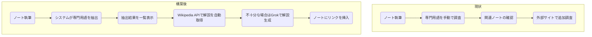
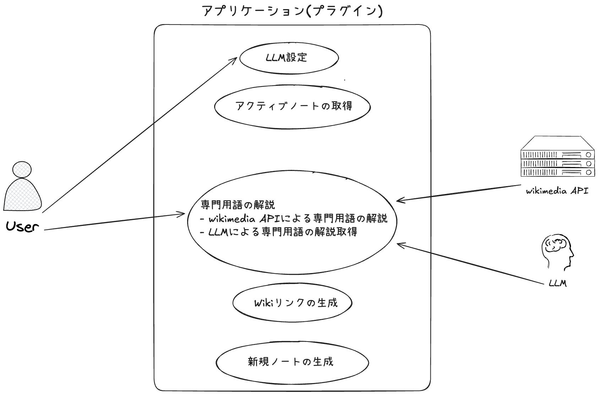

# 要件定義書

## 1. 目的

本システムは、**Obsidianノート**上での執筆作業を支援するため、以下の機能を提供することを目的とします。

- ノートのテキストから専門用語を自動抽出する。
- 抽出した専門用語の解説を、Wikipedia APIまたはGrokによって取得・生成する。
- 必要に応じてノート内にWikiリンクを作成し、参照しやすくする。

これにより、ユーザーは執筆中に専門用語の定義や背景知識を素早く把握でき、情報収集の時間を大幅に短縮できます。

---

## 2. システム構成

本システムは、以下の4つのコンポーネントで構成されます。

### 2.1 専門用語抽出モジュール

- Grokなどの自然言語処理技術を用いて、ノートの文章から専門用語を自動抽出する。
- 利用者の分野に応じた精度向上（カスタム辞書や学習モデルの差し替え等）の仕組みを検討。

### 2.2 Wikipedia API連携モジュール

- 抽出した専門用語に対してWikipedia APIを呼び出し、概要や関連情報（タイトル、概要、URLリンク、画像など）を取得する。

### 2.3 Grok解説生成モジュール

- Wikipediaの説明が不十分・不適切な場合、ユーザーがGrokに専門用語の解説生成を依頼できる。
- Grokの出力結果はユーザーが確認し、必要に応じて編集可能。

### 2.4 UIコンポーネント

- 抽出された専門用語の一覧を表示する画面。
- Wikipedia APIやGrokから取得・生成した解説を表示するパネル。
- ノート内にWikiリンクを挿入するためのボタンや設定画面。

---

## 3. 用語定義

- **専門用語抽出**  
    Grokなどを活用し、文章中に含まれる固有名詞や専門用語を特定し、リスト形式で取得する機能。
    
- **Wikipedia API**  
    Wikipediaの情報を取得するためのREST API。エンドポイント例: `https://ja.wikipedia.org/w/api.php` など。
    
- **Grok**  
    AIを用いた自然言語処理システム。与えられたテキストや専門用語に対して、要約・解説を生成可能。
    
- **Wikiリンク**  
    Obsidianノート内で `[[専門用語]]` という形式を用いて相互リンクを作成する機能。
    

---

## 4. 業務要件

### 4.1 業務フロー図の作成と整理

- LLM(Grok)の設定の登録(業務要件1)
- アクティブノートの取得(業務要件2)
- LLMによる専門用語の抽出(業務要件3)
- wikimedia APIによる専門用語の解説取得(業務要件4)
- 取得情報の表示(業務要件5)
- LLMによる専門用語の解説取得(業務要件6)
- Wikiリンクの生成(業務要件7)

### 4.2 業務フロー（現状と構築後の比較）

#### 現状のフロー

1. ユーザーがObsidianでノートを執筆する。
2. 専門用語を見つけるたびに手動で調査し、既存ノートや外部サイトを参照する。
3. 関連情報が見つからない場合は、新規ノート作成やブラウザでの追加調査を行う。

#### 構築後のフロー

1. ユーザーがObsidianでノートを執筆する。
2. システムが自動的に専門用語を抽出し、候補をリスト化する。
3. Wikipedia APIから解説を自動取得し、ユーザーに表示する。
4. より詳細な説明が必要な場合、Grokで解説を生成する。
5. 必要に応じて、ノート内にWikiリンク（`[[専門用語]]`）を挿入する。

---

## 5. 機能要件

1. **LLM設定入力機能**  
    ユーザーがAPIキー、LLMモデルの設定を入力する（機能要件1）。
    
2. **専門用語取得機能**  
    LLMを用いてアクティブノートから専門用語を抽出する（機能要件2）。
    
3. **解説表示機能（wiki）**  
    wikimedia APIにより、専門用語の解説を取得・表示する（機能要件3）。
    
4. **解説表示機能（LLM）**  
    LLMによる専門用語の解説を取得・表示する（機能要件4）。
    
5. **Wikiリンク生成機能**  
    専門用語を`[[]]`で囲んでWikiリンクを作成する（機能要件5）。
    
6. **新規ノート生成機能**  
    専門用語の解説を新規ノートとして生成する（機能要件7）。
    

---

## 6. 非機能要件

### 6.1 ユーザビリティ及びアクセシビリティ

- **対象:** Obsidianユーザー
- **基準:** ユーザーの操作回数を1～3回に抑え、設定項目を最小限にする。

### 6.2 性能

- **応答時間:**  
    一般的な個人利用（数千～数万文字のノート）において、専門用語抽出や解説取得が目標5秒以内、最低でも10秒以内に完了すること。

---

## 7. ユースケースの定義

### 7.1 利用者とシステムの役割

- **ユーザ**
    
    - LLM設定の入力
    - 専門用語の解説確認
    - Wikiリンクの生成
- **アプリ**
    
    - LLM設定の取得
    - アクティブノートの取得
    - wikimedia APIによる専門用語の解説取得
    - LLMによる専門用語の解説取得
    - Wikiリンクの生成
    - 新規ノートの生成

---

## 8. 画面設計

### 8.1 設定画面

- LLMのAPIキー入力フィールド
- LLMモデル選択フィールド（プルダウン）

### 8.2 専門用語解説画面

- wikimedia APIによる解説表示
- LLMによる解説表示
- LLM解説取得実行ボタン
- Wikiリンク生成および新規ノート生成実行ボタン

---

## 9. 利用者と規模

### 9.1 利用者

- **Obsidianユーザー:**
    - **個人レベル:** 研究者、学生、技術者、ライターなど
    - **チームレベル:** プロジェクト内で知識共有を行うチーム

### 9.2 規模

- **初期:** 個人利用を想定
- **将来:** チームや組織内での利用拡大を視野に入れる  
    ノート数や文字量が増加した際のパフォーマンスや拡張性も考慮する。

---

## 10. 互換性

- **Obsidianの最新安定版**との互換性を維持。
- **Wikipedia API**や**Grok**のバージョンアップ・仕様変更に柔軟に対応できる拡張性を確保。

---

## 11. 信頼性・可用性

- Wikipedia APIやGrok APIが利用不可の場合でも、ノート執筆や既存リンクの参照に支障が出ないようにする。
- 連携エラー発生時は、ユーザーに分かりやすいエラーメッセージを表示し、手動リトライや代替手段（例：別の検索エンジン利用など）を促す。

---

## 12. セキュリティ

- APIキーやユーザー認証情報は厳重に保管し、第三者への漏洩を防止する設計とする。
- 可能であれば、Obsidianプラグインが提供するセキュアなストレージを活用する。
- 通信はHTTPSを用い、APIキーの平文送信を防ぐ。

---

## 13. 運用・保守要件

1. **設定変更の容易性**
    
    - UI上でWikipedia APIの言語設定やGrokのAPIキーを変更できるようにする。
    - APIが有料の場合、月間利用回数の確認や課金状況が把握できる仕組みを検討する。
2. **バージョン管理**
    
    - Obsidianプラグインとして提供する場合、GitHub等を利用したリリース時のバージョン管理を行う。
    - GrokやWikipedia APIの変更点を随時追跡し、対応版をリリースする。
3. **ログ管理**
    
    - 専門用語抽出や解説取得のリクエスト履歴を保持し、トラブルシュートに活用する。
    - 個人利用の場合は簡易的な管理で十分だが、チーム利用を想定する場合はアクセスログの管理も検討する。

---

## 14. 導入効果

1. **作業効率の向上**
    
    - 従来の手動検索による時間を大幅に削減。
    - ノート執筆の流れを中断することなく、解説情報に即時アクセス可能。
2. **ノート品質の向上**
    
    - 専門用語の解説を容易に挿入できるため、文書全体の分かりやすさが向上。
    - Wikiリンク作成により、関連ノートとの相互参照が促進され、知識の体系化が実現。
3. **学習コスト削減**
    
    - 分野外の専門用語にも迅速にアクセスでき、学習が円滑に進む。
    - ユーザーが追記した解説を資産として蓄積可能となる。

---
